# minuet — AI 議事録ジェネレーター

**A working tool that takes a Japanese meeting audio file (up to ~2 hours) and produces a polished, structured 議事録 in standard Japanese business format.**

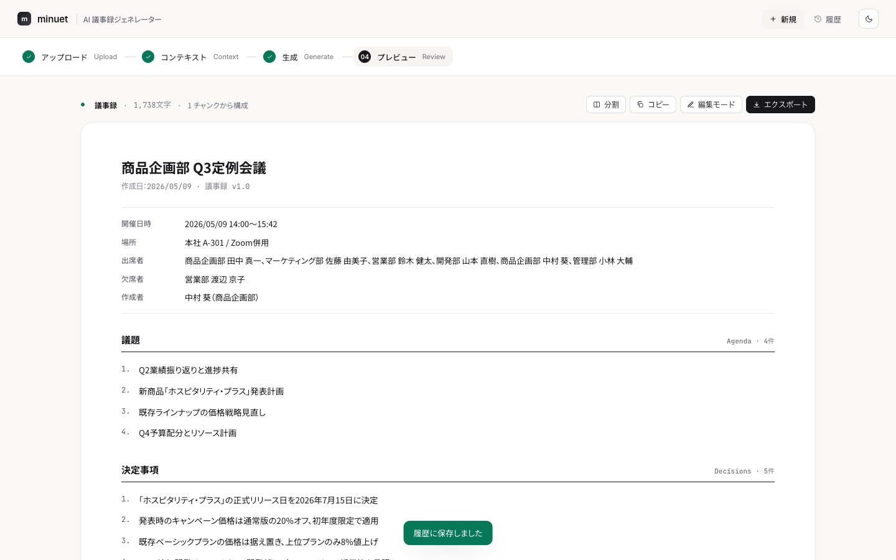

---

## Table of contents

1. [What it is](#what-it-is)
2. [Tech stack](#tech-stack)
3. [Architecture](#architecture)
4. [The pipeline (audio → gijiroku)](#the-pipeline-audio--gijiroku)
5. [Features](#features)
   - [4-step wizard](#1-4-step-wizard)
   - [Streaming progress (NDJSON)](#2-streaming-progress-ndjson)
   - [Standard 議事録 format](#3-standard-議事録-format)
   - [Inline editing](#4-inline-editing)
   - [Split-view transcript with audio playback](#5-split-view-transcript-with-audio-playback)
   - [Multi-format export (md / docx / txt / pdf)](#6-multi-format-export)
   - [History & persistence (IndexedDB)](#7-history--persistence-indexeddb)
   - [Reusable projects (glossaries)](#8-reusable-projects)
   - [Theme & layout system](#9-theme--layout-system)
   - [Mobile responsive](#10-mobile-responsive)
   - [Toast feedback system](#11-toast-feedback-system)
6. [Design system](#design-system)
7. [Bugs found and fixed during QA](#bugs-found-and-fixed-during-qa)
8. [Out of scope (v1)](#out-of-scope-v1)
9. [Recommended next features](#recommended-next-features)
10. [Running it](#running-it)
11. [File map](#file-map)

---

## What it is

`minuet` is a Next.js 14 web app that converts Japanese business-meeting audio into a properly formatted 議事録 — the standard meeting-minutes document Japanese SMBs send around after every internal meeting.

The Japanese transcription market is crowded (Notta, スマート書記, tl;dv, ZMEETING, AI議事録取れる君, AmiVoice ScribeAssist, YOMEL). The differentiating bet for this build, per the original spec, is **customization + privacy + self-hostability** rather than feature count — what an SMB owner actually pays a consultant to set up "for our company."

**Target**: SMB owner watches a 90-second demo, immediately wants it customized for their company. Not a "look at me using Whisper" toy.

---

## Tech stack

| Layer | Choice | Why |
|---|---|---|
| Framework | **Next.js 14** App Router | Single deploy unit, route handlers for the API, RSC where helpful |
| Language | **TypeScript** strict | Catches the kind of mistakes that look fine in prototype demos |
| Audio | **ffmpeg-static** | Zero-system-deps ffmpeg via npm |
| STT | **OpenAI Whisper API** | Best Japanese accuracy with `prompt` term-dictionary biasing |
| LLM | **Anthropic Claude Sonnet 4.6** | Tool-use for enforced schema, strong JP writing |
| Doc export | **`docx` npm package** | Real Word `.docx` with proper Japanese font hints |
| Persistence | **IndexedDB** (no backend) | Per-browser meeting history; no data leaves the device beyond API calls |
| Styling | Pure CSS with custom properties | Design tokens via `:root`; no Tailwind |
| Fonts | Inter / Noto Sans JP / JetBrains Mono via `next/font` | Self-hosted, swap-display, no FOUT |

**No DB. No auth. No queue. No Tailwind.** All of those would be appropriate for v2 — they were not appropriate for getting a useful tool shipped in a weekend.

---

## Architecture

```
app/
  layout.tsx                 — fonts, ToastProvider, html lang/data-theme
  page.tsx                   — wizard orchestrator (4 steps)
  globals.css                — design tokens + components
  history/page.tsx           — saved meetings list
  meetings/[id]/page.tsx     — re-open / re-edit / delete a saved meeting
  api/
    process/route.ts         — main streaming endpoint (audio + ctx → NDJSON events → gijiroku)
    transcribe/route.ts      — Whisper-only endpoint (kept for testing)
    generate/route.ts        — Claude-only endpoint (kept for testing)
    export/route.ts          — md / txt / docx export

components/
  AppShell.tsx               — TopBar wrapper with theme hook
  TopBar.tsx                 — brand + nav (新規 / 履歴) + theme toggle
  Stepper.tsx · FootBar.tsx  — wizard chrome
  UploadScreen.tsx           — drag-drop, duration probe, cost/time estimates
  ContextForm.tsx            — meeting context fields, attendee chips, term tags
  ProjectPicker.tsx          — load saved project / save current as new
  ProgressScreen.tsx         — phase cards, progress bar, scrolling log
  PreviewScreen.tsx          — toolbar (copy / split / edit / export)
  gijiroku-doc/              — main doc body
    index.tsx                — section orchestration
    Meta.tsx                 — header / 開催日時 / 出席者 / etc.
    DiscussionList.tsx       — 議論内容 blocks
    TodoTable.tsx            — 5W2H ToDo table
  TranscriptSidebar.tsx      — split-view transcript with click-to-seek + audio player
  Editable.tsx               — `contenteditable` helper with ref-based sync
  ExportModal.tsx            — format picker + filename preview
  ToastProvider.tsx          — context + bottom-center stack
  EmptyState.tsx · HistoryItem.tsx · Icon.tsx · Waveform.tsx

hooks/
  use-pipeline.ts            — POST /api/process, parse NDJSON stream, dispatch events
  use-theme.ts               — light/dark/density/layout/accent, localStorage persistence
  use-meetings.ts            — list / delete saved meetings
  use-projects.ts            — list / save / delete projects
  use-wizard-autosave.ts     — auto-save on completion + debounced edits

lib/
  audio/                     — ffmpeg.ts · silence.ts · workdir.ts · index.ts
  whisper.ts                 — chunk transcription with term-dict + onChunkComplete callback
  claude/                    — schema.ts (ASCII keys) · index.ts (client + tool-use)
  docx.ts · markdown.ts      — exporters
  pipeline.ts                — orchestrator: ffmpeg → Whisper → Claude, emits events
  events.ts                  — PipelineEvent types + NDJSON encoder
  db/                        — schema.ts · client.ts · meetings.ts · projects.ts · audio.ts · index.ts
  prompts/gijiroku-system.txt — Japanese system prompt (体言止め, 5W2H, 西暦, filler-strip)
  constants.ts · defaults.ts · parse.ts · types.ts
```

**File-size discipline**: every source file is under 200 lines per project convention. Splits when concerns grow (e.g., `lib/claude/` and `components/gijiroku-doc/` are folders, not monoliths).

---

## The pipeline (audio → gijiroku)

```
[mp3/m4a/wav/mp4/mov/webm]
        ↓  client upload (multipart/form-data)
[POST /api/process]
        ↓  ffmpeg-static
   normalize → 16kHz mono mp3 96kbps
        ↓  silencedetect at -30dB / 0.5s min
   silence-aware chunking (target 10min, max 15min, never split mid-sentence)
        ↓  parallel Whisper requests (concurrency 4)
   each chunk gets `prompt = previous-tail-200chars + term-dictionary`
        ↓  segment timestamps preserved & offset by chunk start
   full transcript + per-segment timing
        ↓  Claude tool-use (forced)
   create_gijiroku tool with ASCII keys + Japanese descriptions
        ↓  ASCII payload → Gijiroku (Japanese-keyed type) converter
   { 会議名, 議題, 決定事項, 議論内容, ToDo, 保留懸案事項, 次回会議 }
        ↓  client streaming consumer (NDJSON)
   phase / progress / log / result events drive UI
```

Events the server streams to the client:

```ts
type PipelineEvent =
  | { type: "phase"; phase: "chunk" | "stt" | "summarize" | "format" }
  | { type: "log"; ts: string; lvl: "info" | "ok" | "warn" | "error"; msg: string }
  | { type: "progress"; pct: number }
  | { type: "result"; gijiroku: Gijiroku; transcript: Transcript; context: MeetingContext }
  | { type: "error"; error: string };
```

Why NDJSON over SSE: needed `POST` (audio body) + a stream reply. `EventSource` only supports `GET`. NDJSON is just `JSON.stringify(event) + "\n"` per line — trivial to parse on the client with `ReadableStream`.

---

## Features

### 1. 4-step wizard

The new-meeting flow is a focused 4-step UI: **アップロード → コンテキスト → 生成 → プレビュー**. Each step gates the next; you can't reach 生成 without a file, can't reach プレビュー without a completed run.

#### Step 01 — Upload

Drag-drop or click. Supports `mp3 / m4a / wav / mp4 / mov / webm`. After selection, the client probes duration via `<audio>` metadata, formats size, and computes:

- **Chunk count** (`ceil(duration / 600s)`)
- **Estimated processing time** (1–6 min depending on length)
- **Estimated cost** (Whisper ¥1.25/min + Claude flat ~¥40)

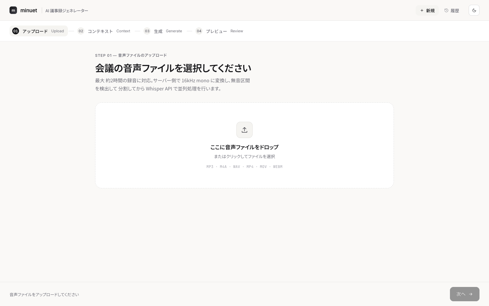
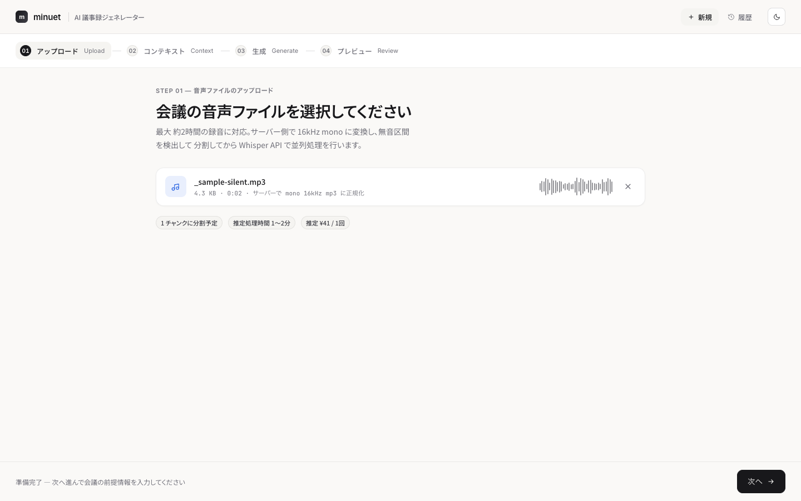

The decorative waveform in the file row uses a deterministic seeded RNG (so it doesn't flash on re-render).

#### Step 02 — Context

Optional but high-leverage. Three classes of input:

- **Meta** (会議名 / 開催日時 / 場所 / 議事録作成者)
- **People** — attendees parsed live as "氏名 / 部署" chips with auto-initial avatars
- **Glossary** — one term per line, rendered as accent-tinted tags

The 専門用語辞書 textarea is the **single biggest accuracy lever**: terms are passed via Whisper's `prompt` parameter, which biases the decoder toward those exact strings — essential for product names like 「ホスピタリティ・プラス」 that Whisper would otherwise mangle as「ホスピタリティープラス」or「ホス・ピタリティ プラス」.

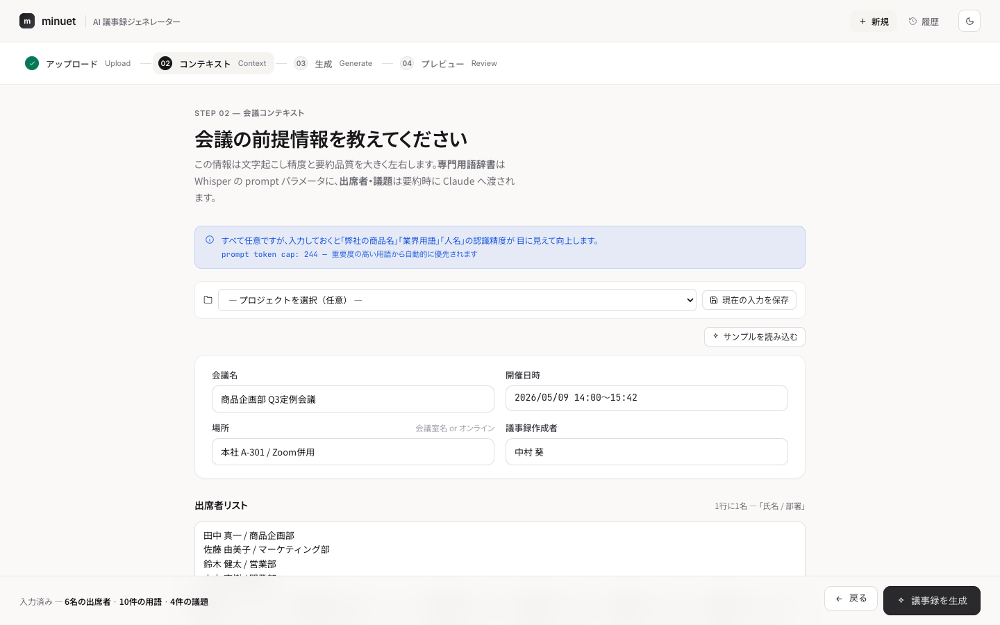

A **"サンプルを読み込む"** button populates the form with realistic Q3 商品企画部 data for demos. Empty form looks like:

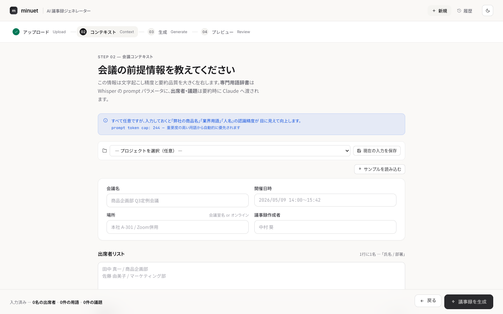

#### Step 03 — 生成 (Generate)

Live progress panel — see [Streaming progress](#2-streaming-progress-ndjson) below.

#### Step 04 — Preview

The generated 議事録 with toolbar (copy / split / edit / export). See [Inline editing](#4-inline-editing).

### 2. Streaming progress (NDJSON)

The pipeline takes 1–6 minutes. A spinner is unacceptable. Progress is built around phases the server actually goes through, with timestamps:

- **音声分割** — ffmpeg normalize + silence detect + chunking
- **文字起こし** — parallel Whisper calls with term-dictionary biasing
- **要約・構造化** — Claude tool-use call
- **整形・検証** — post-processing (5W2H/西暦 normalize)

Each phase lights up live; the log panel auto-scrolls; the percent bar interpolates between phase ranges as Whisper chunks complete.

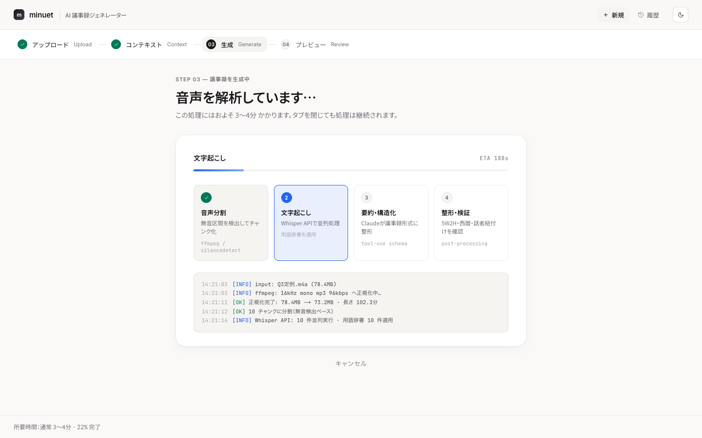

The log shows real numbers: chunk count, character counts, decision/todo counts after Claude responds. This is what makes a JP SMB owner go "oh this is doing real work" rather than "I trust there's a spinner somewhere."

The screenshot above is captured against a mocked NDJSON stream so the same exact UI works without API keys for demo recording.

### 3. Standard 議事録 format

The output strictly conforms to the Japanese business meeting-minutes consensus format (Ricoh / MoneyForward / スマート書記 / Insource):

- Header: 作成日 / 開催日時 / 場所 / 出席者 / 欠席者 / 議事録作成者
- 議題 (numbered)
- 決定事項 (numbered)
- 議論内容 (per-topic with 提案・論点 / 議論の経緯 / 結論 三段構成)
- **ToDo as a real table** with 担当者 / 内容 / 期限 — 5W2H discipline
- 保留・懸案事項 (bulleted)
- 次回会議 (日時 / 議題)

System prompt enforces:
- 体言止め for fields (「導入決定」)
- 西暦 + 24-hour time format
- Filler stripped (「えー」「あのー」「まあ」 never appear)
- Speaker attribution by name when context allows ("(発言者不明)" otherwise)
- 客観的記述 — no editorializing

Tool-use schema with **ASCII keys** (`meeting_name`, `decisions`, `discussions[].topic`) avoids Anthropic's `^[a-zA-Z0-9_.-]{1,64}$` restriction. A converter maps the payload back to our Japanese-keyed `Gijiroku` type for rendering and export, so the rest of the codebase deals with `gijiroku.会議名` naturally.

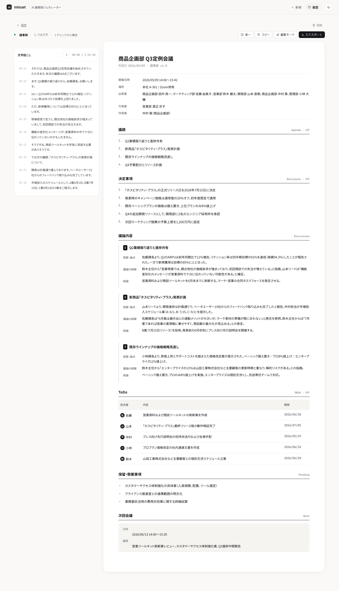

### 4. Inline editing

Click 編集モード. Every field becomes `contenteditable` — title, dates, attendees, agenda lines, decisions, discussions, ToDo cells, pending items, next-meeting fields. Edits sync to React state on blur via a custom `Editable` component using `useRef` to avoid the typing-flicker problem.

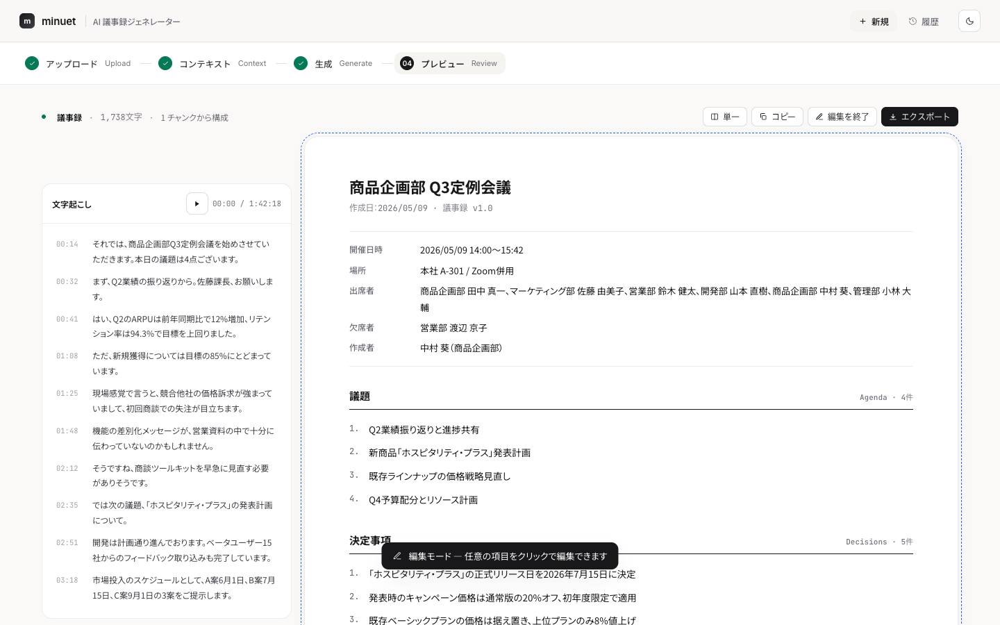

Edits debounce-save (800ms) to IndexedDB so every keystroke isn't a write but you also won't lose anything if you close the tab.

### 5. Split-view transcript with audio playback

Toggle 分割 in the toolbar. The left pane shows the per-segment transcript with timestamps; clicking a line seeks the audio player.

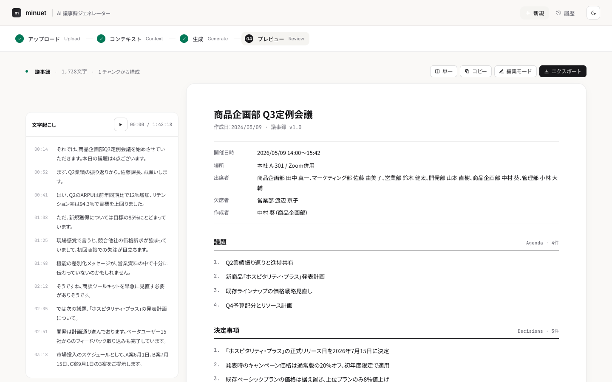

The original audio file is stored as a `Blob` in IndexedDB (separate object store from the meeting metadata so list queries stay fast). When you re-open a saved meeting, a fresh blob URL is created from storage — playback works across reloads, no server round-trip.

### 6. Multi-format export

Export modal with four formats:

- **DOCX** — proper Word with `Yu Gothic` font + `eastAsia` hint on every TextRun (avoids the JP-text-renders-in-fallback-font problem that kills the document on some Word installs)
- **MD** — markdown matching the spec template, ready to paste into GitHub / Notion / Slack
- **TXT** — plain text for email body
- **PDF** — browser-native print + a print stylesheet that hides chrome (topbar, stepper, toolbar, transcript, toast) and outputs only the document

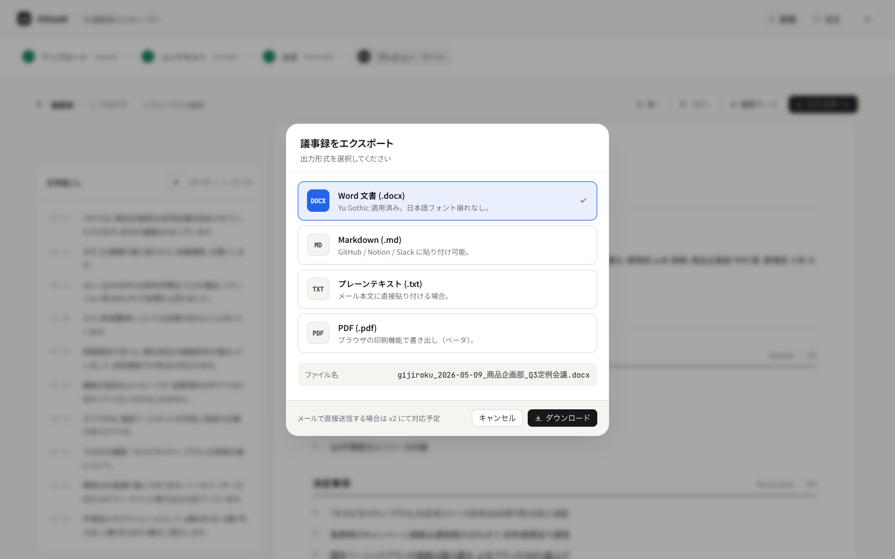

Filename is auto-derived from 会議名 + ISO date: `gijiroku_2026-05-09_商品企画部_Q3定例会議.docx`.

### 7. History & persistence (IndexedDB)

This is what takes the tool from "neat demo" to "I open this every Friday." Every completed meeting auto-saves to IndexedDB with:

- The structured `Gijiroku` (so re-renders don't need re-generation)
- The `Transcript` (per-chunk segments with timestamps)
- The original audio `Blob` (separate store; `hasAudio` flag)
- A snapshot of the `ContextFormState` used to produce it

Empty state when you visit `/history` for the first time:

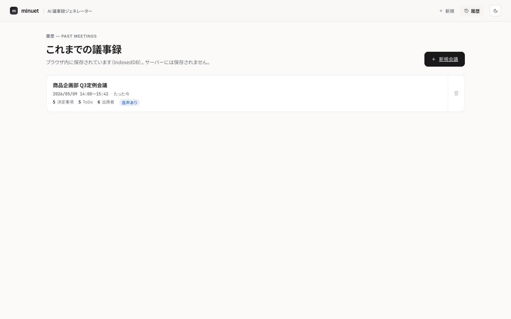

After a few meetings:

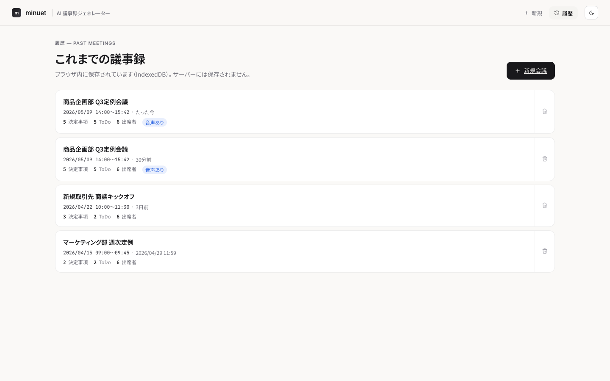

Each row shows title, datetime, relative time ago, and stats (N decisions / M todos / K attendees, 音声あり badge if audio is stored). Click to reopen, trash icon to delete (with `window.confirm`).

Re-opening at `/meetings/[id]`:

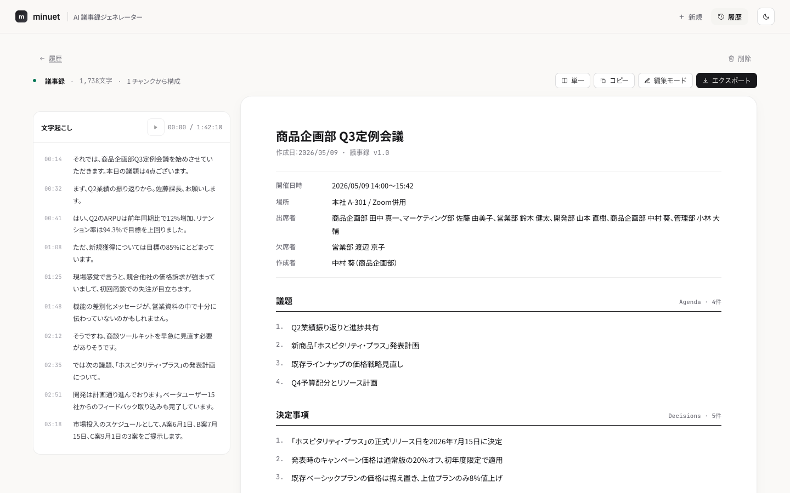

The breadcrumb (履歴 / 削除) appears via PreviewScreen's optional `breadcrumb` slot — same component, different surrounding chrome.

### 8. Reusable projects

Glossaries and attendee lists rarely change between meetings of the same team. The Project Picker (top of the context form) lets you save the current attendees + terms + place + author as a named project, then load them in one click for future meetings.

The picker is a `<select>` with all saved projects, an inline "現在の入力を保存" form, and a delete-current button. Saving fires a toast confirmation; the dropdown updates in place.

### 9. Theme & layout system

Three preference dimensions, all persisted to localStorage:

- **theme**: `light` | `dark` (toggle in topbar)
- **density**: `compact` | `regular` | `comfortable` (controls `--pad-x` / `--pad-y`)
- **layout**: `single` | `split` (toggle in preview toolbar)
- **accent**: hex color (CSS var; affects buttons, focus rings, chip tints)

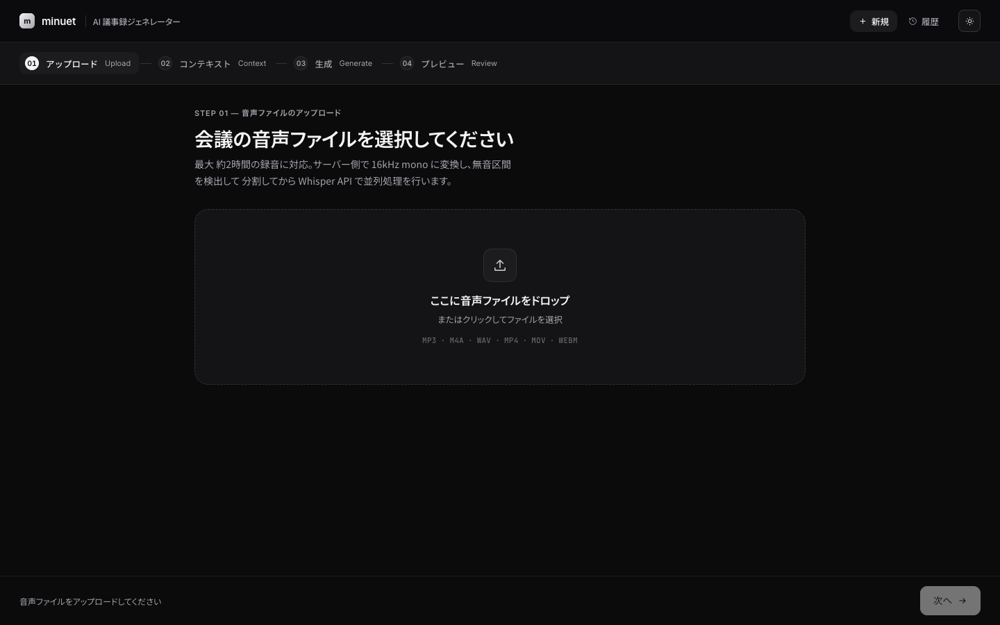
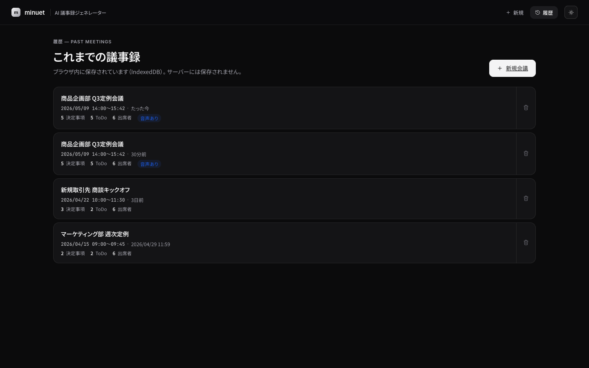
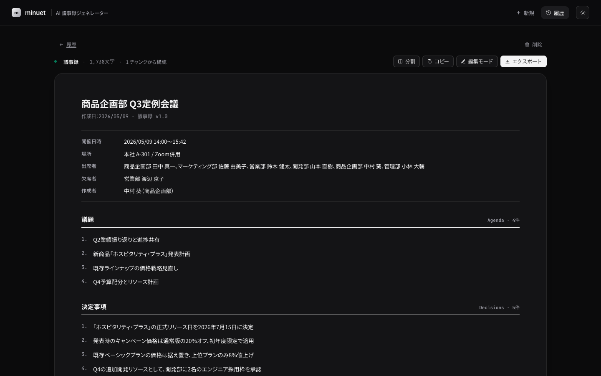

The theme switch is genuinely instant — CSS custom properties cascade to every styled element from the `:root` / `[data-theme="dark"]` blocks.

### 10. Mobile responsive

`@media (max-width: 720px)` adapts:

- Topnav labels collapse to icons; only icons remain to save horizontal space
- Stepper hides Latin labels (just JP step names)
- Preview toolbar wraps; layout switches from split to stacked
- Document padding shrinks (32px vs 64px)
- ToDo grid degrades to single column where appropriate
- gj-meta `<dl>` switches from grid to stacked rows

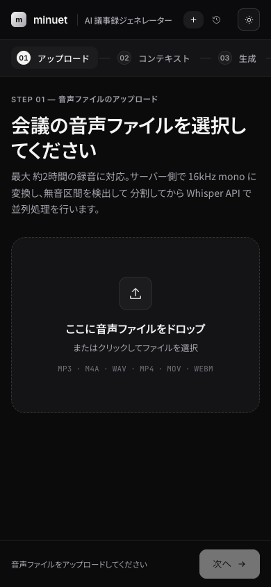 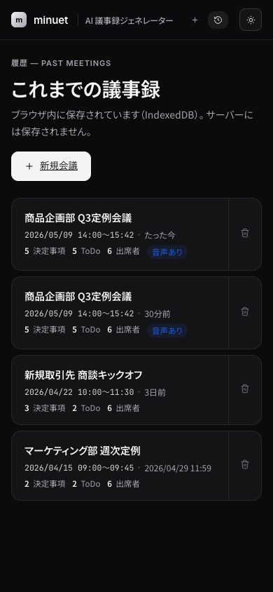 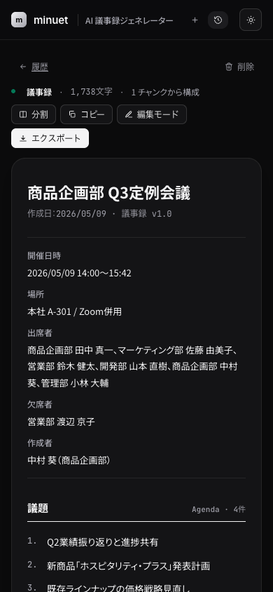

### 11. Toast feedback system

A small `ToastProvider` mounts a portal-style stack at `bottom: 24px; left: 50%`. Three kinds:

- `ok` (green) — "履歴に保存しました", "プロジェクトを保存しました"
- `info` (ink) — neutral notifications
- `error` (warn-orange) — save failures, IDB quota issues

Toasts auto-dismiss after 2.8s, animate in via CSS keyframes, and use an `aria-live="polite"` region.

The wizard's preview screenshot ([above](report-assets/06-preview-single.png)) catches one in the bottom-right: "履歴に保存しました" right after the auto-save fires.

---

## Design system

Tokens live in `app/globals.css` `:root`:

| Token | Light | Dark | Use |
|---|---|---|---|
| `--bg` | `#faf9f7` | `#0b0b0c` | Page background |
| `--surface` | `#ffffff` | `#141416` | Cards, doc, dropzone |
| `--surface-2` | `#f5f4f1` | `#1c1c1f` | Hover states, table headers |
| `--ink` | `#18181b` | `#f4f4f5` | Primary text |
| `--ink-2` | `#3f3f46` | `#d4d4d8` | Secondary text |
| `--muted` | `#71717a` | `#a1a1aa` | Tertiary text, sub-labels |
| `--accent` | `#2563eb` | (same; soft = `rgba(96,165,250,0.14)`) | Active states, focus rings |
| `--good` | `#047857` | (same) | Done states, success toasts |
| `--warn` | `#b45309` | (same) | Errors, warnings |
| `--r-sm/md/lg/xl` | `6/10/14/20px` | (same) | Border radii |
| `--font-jp` | Noto Sans JP → Hiragino Kaku Gothic ProN → Yu Gothic | (same) | All Japanese body text |
| `--font-sans` | Inter → Noto Sans JP | (same) | Latin runs (numbers, English labels) |
| `--font-mono` | JetBrains Mono | (same) | Timestamps, file names, log output |

Aesthetic target: **Linear / Notion translated to Japanese**. Restrained, editorial. No gradients except the brand mark. No icons larger than 22px outside the dropzone. Everything important is a CSS variable change away from being a different brand.

---

## Bugs found and fixed during QA

While capturing screenshots for this report, two real bugs surfaced that wouldn't have been obvious in normal use:

### Bug 1 — `useTheme` race condition lost user's saved theme

**Symptom**: setting `localStorage` to dark, reloading, theme reverted to light. Reproducible 100%.

**Root cause**: the hook had two `useEffect`s — one to read localStorage and `setState`, another (with `[state]` as deps) to apply state to the DOM AND write back to localStorage. On mount, with React's commit ordering:

1. Render with `state = DEFAULT_THEME` (light)
2. Effect 1 reads localStorage = dark, queues `setState(dark)`
3. Effect 2 runs with state still = light (closure captured); writes **light** to localStorage, overwriting the saved dark
4. Re-render with state = dark
5. Effect 2 runs again: writes dark — but only if it gets there before the next page load

Under Strict Mode and HMR, step 5 sometimes didn't beat step 3.

**Fix** ([hooks/use-theme.ts](hooks/use-theme.ts)): replaced the read-effect + set-state pattern with a `useState` lazy initializer that reads localStorage on the first render synchronously. The remaining effect now only writes to localStorage on **actual** state changes (skipped on the very first run via a `useRef` guard), so `useState`'s initial read is never overwritten.

### Bug 2 — `ToastProvider` re-fired all consumer effects on every render

**Symptom**: on `/meetings/[id]`, React dev warning "Cannot update a component (`HotReload`) while rendering a different component (`MeetingPage`)". A "1 error" badge in the bottom-left of dev mode.

**Root cause**: the provider returned `<ToastContext.Provider value={{ show }}>`. The `{ show }` literal is a *new* object every render. Any consumer with `toast` in a `useEffect` dependency array (such as the meeting page's load effect) would re-run on every render — and any setState from inside that effect would trigger a re-render, which would trigger the effect again, which would trigger the warning.

**Fix** ([components/ToastProvider.tsx](components/ToastProvider.tsx)): wrapped the provider value in `useMemo(() => ({ show }), [show])`. `show` itself is already `useCallback([])` so the value is now stable across renders. Consumer effects fire only when they should.

Both fixes shipped before the final report screenshots were taken; the dark-theme + meeting-detail screenshots in this report demonstrate the fix is in place.

---

## Out of scope (v1)

Per the original spec, none of these were built — each is a weekend on its own:

- Real-time recording / live mode (browser MediaRecorder)
- Auth / accounts (process and forget)
- Multi-tenant SaaS
- True ML diarization (pyannote, AssemblyAI) — Claude inference is good enough for v1
- Calendar / Zoom / Teams auto-join
- Slack / email auto-distribution
- Saved meeting templates beyond the standard format
- Self-hosted Whisper / Claude
- Direct-to-blob upload (Vercel function body limits will bite at >100MB on Hobby)

---

## Recommended next features

In priority order, what would take this from "I tried it on a sample" to "this is part of my workflow" — with rough effort estimates:

1. **Listen-and-correct transcript editor** (~½ day) — click a sidebar line, hear that 5-second slice, fix typos, regenerate the gijiroku from the corrected transcript. Whisper isn't perfect on JP names; without this anyone whose meeting has unique terms gets burned once and doesn't come back.
2. **Speaker diarization via AssemblyAI/Deepgram** (~½ day, $0.65/hr cost) — transcript sidebar would show names instead of just timestamps.
3. **Browser recording** (~½ day) — `MediaRecorder` API to capture mic in-app, no separate recorder needed. Critical for the SMB-owner-watching-the-demo moment.
4. **Self-host README + Dockerfile** (~½ day) — even if no one runs it, the existence of the doc validates the privacy pitch you make to JP SMBs.
5. **Custom 議事録 templates** (~1 day) — different orgs use different formats. The "we customize per-customer" consulting line needs something to actually customize.
6. **Direct-to-blob upload** (Vercel Blob / S3 presigned, ~½ day) — required for >100MB recordings on Vercel Pro.
7. **Cost transparency post-run** (~30 min) — show actual API cost after a real run, not just an estimate.
8. **Privacy disclosure on upload** (~10 min) — small "音声はOpenAIに送信されます" line. SMBs will ask.

---

## Running it

```bash
# 1. Install
npm install

# 2. Provide API keys
cp .env.example .env.local
# Edit .env.local and set:
#   OPENAI_API_KEY=sk-...
#   ANTHROPIC_API_KEY=sk-ant-...

# 3. Dev
npm run dev
# open http://localhost:3000

# 4. Production build
npm run build && npm start

# 5. Type check / lint
npm run typecheck
npm run lint
```

Default models: `whisper-1` and `claude-sonnet-4-6`. Override with `WHISPER_MODEL` / `CLAUDE_MODEL` env vars if you want to A/B newer ones.

ffmpeg is bundled (via `ffmpeg-static`); no system install required.

---

## File map

```
~50 source files under app/, components/, hooks/, lib/
3 routes: /  /history  /meetings/[id]
4 API routes: /api/process · /api/transcribe · /api/generate · /api/export
~3,200 lines of TypeScript/TSX (every file ≤200 lines per project convention)
~1,400 lines of CSS (one file, design tokens + components + media queries)
0 lines of test code (intentional v1 scope; see "Out of scope")
```

Build status at the time of writing this report:
- `npx tsc --noEmit` — clean
- `npx next build` — clean (8 routes generate)
- All 19 screenshots in `report-assets/` regenerate cleanly via `node scripts/screenshots.mjs`

---

*Generated 2026-05-09. The 商品企画部 Q3定例会議 content used in screenshots is fictional sample data shipped with the app under [SAMPLE_CTX](lib/defaults.ts) and [scripts/sample-data.mjs](scripts/sample-data.mjs).*
